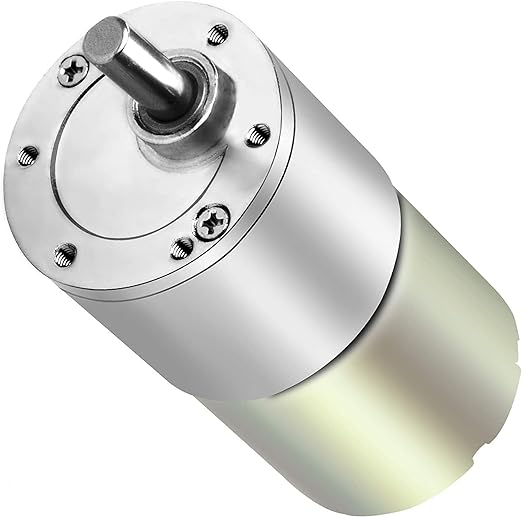
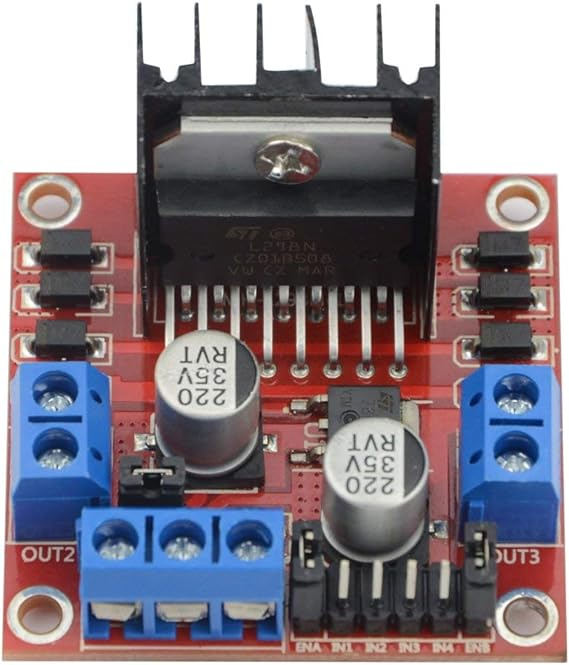
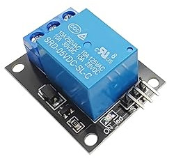
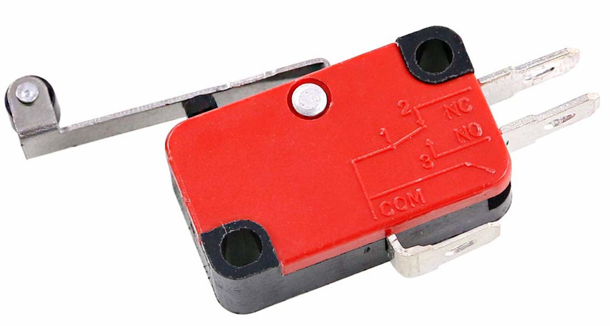
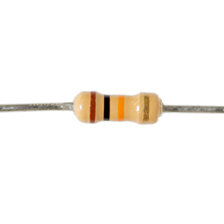
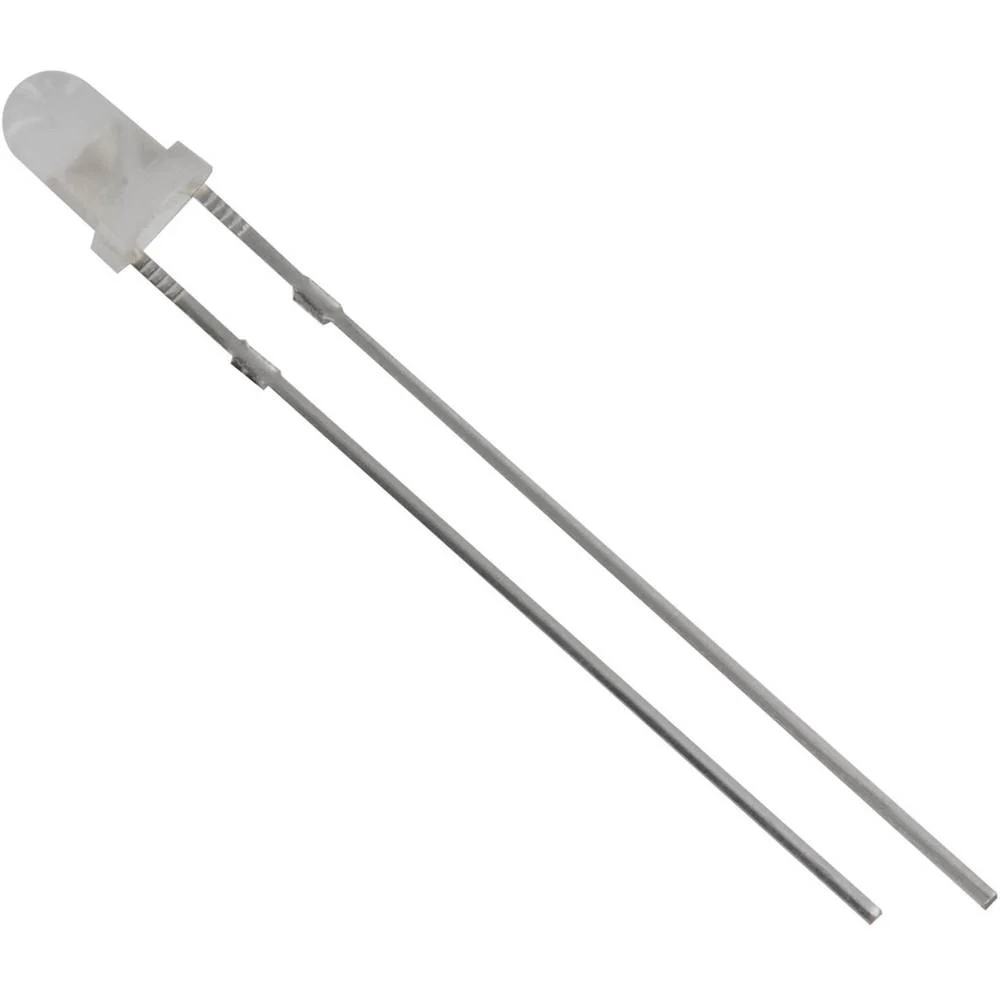
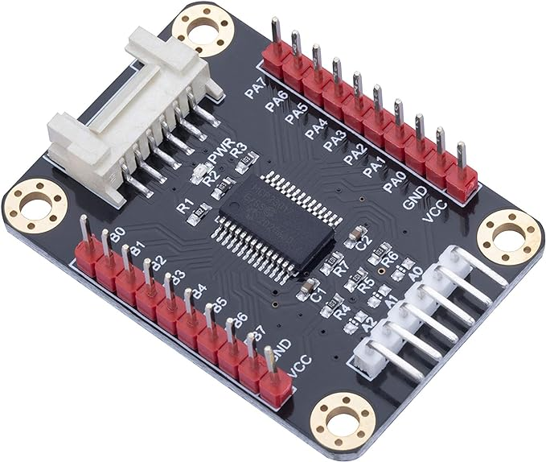
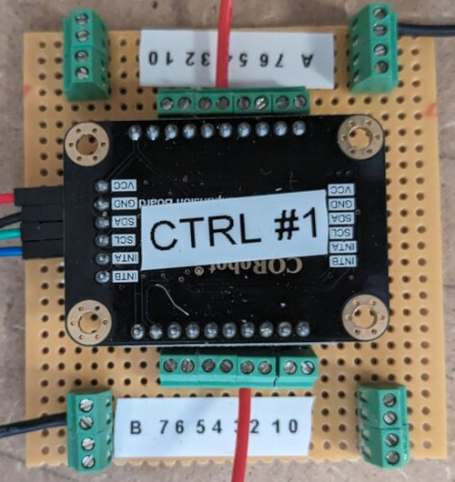
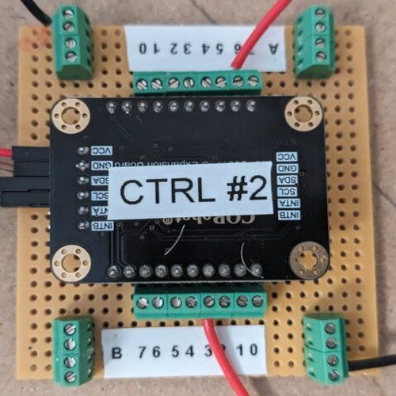
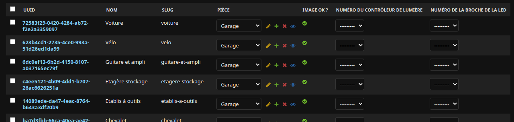

# Moteur

## Matériels nécessaires

| Photo | Description | Quantité | Lien fournisseur |
| ----- | ----------- |----------| ---------------- |
|       | Moteur à courant continue 12V avec réducteur | 1 | [Lien](https://www.amazon.fr/gp/product/B0824V7YGT/ref=ppx_yo_dt_b_asin_title_o07_s00?ie=UTF8&psc=1)|
|       | Pilote L298N de moteurs à courant continu. Permet de contrôler le moteur avec un raspberry | 1 | [Lien](https://www.amazon.fr/gp/product/B07MY33PC9/ref=ppx_yo_dt_b_asin_title_o00_s02?ie=UTF8&psc=1)|
|       | Relais 5V. Permets de couper l'arriver du courant dans le pilote du moteur et ainsi stopper le moteur | 1 | [Lien](https://www.amazon.fr/gp/product/B0C4HHBN1Z/ref=ppx_yo_dt_b_asin_title_o08_s02?ie=UTF8&psc=1)|
|       | Capteur de fin de course. Permet d'arrêter le moteur à un endroit précis | 2 | [Lien](https://www.amazon.fr/gp/product/B07SMC2QD6/ref=ppx_yo_dt_b_asin_title_o00_s00?ie=UTF8&psc=1)|
|      | Résistance de 10 kOhm à mettre entre le capteur de fin de course et le raspberry | 2 | / |

## Câblage

# Lumière

| Photo | Description | Quantité | Lien fournisseur |
| ----- | ----------- |----------| ---------------- |
|       | LED 3mm 3500mcd 60° 20 mA 3.1 V | 50 | [Lien](https://www.conrad.fr/fr/p/tru-components-1573706-led-blanc-rond-3-mm-3500-mcd-60-20-ma-3-1-v-1573706.html)|
|      | Carte d'extension des GPIO. Permet d'avoir plus d'entrée-sorties | 3 | [Lien](https://www.amazon.fr/gp/product/B08DFNR2JW/ref=ox_sc_act_title_10?smid=A22SB6W8K59090&psc=1) |

Pour faciliter le montage des cartes d'extensions, il est recommandé de réaliser un montage sur carte d'essai. Pour cela, il faut souder des connecteurs mâles sur la carte d'extension et des connecteurs femelles sur la carte d'essai. 

Priviliégier des connecteurs de type 'bornier'. Cela permet de brancher et débrancher facilement les fils.

 
 

## Affectation des lumières aux objets

On peux remarquer que les connecteurs sont numérotés. 

Dans l'administration de l'application, il faut donc affecter les lumières aux connecteurs correspondants.

Rendez-vous sur `http://<IP_PC_PRINCIPAL>:8080/admin/core/item/` et compléter les champs relative aux lumières

